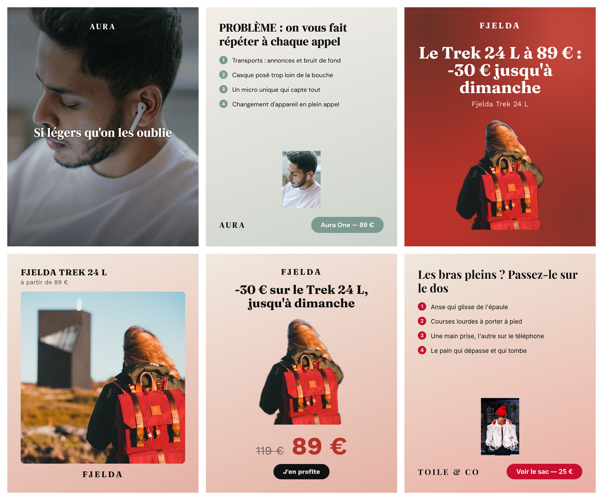
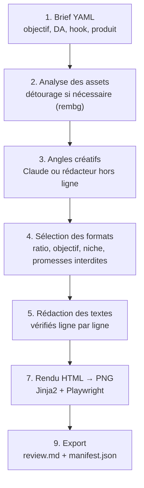

# Ad Agent

Un agent IA qui transforme un **brief** (objectif, direction artistique, hook, produit, images) en plusieurs
**variantes d'ads statiques**, en s'appuyant sur une base de formats construite à partir de vraies publicités
observées sur Meta Ad Library. Chaque variante est un vrai fichier PNG, prêt à publier ou à retoucher.



*Rendus réels de l'agent (rédacteur Claude, rendu Firefox) pour trois produits fictifs, à partir d'une photo
libre de droits chacun et d'un brief sans direction créative : 5 formats différents choisis par l'agent,
fonds et polices tirés de la DA. Briefs : [`briefs/demo_*.yaml`](briefs/).*

## Pourquoi ce projet

C'est un projet de portfolio, construit pour montrer un pipeline complet et testé de bout en bout, pas
seulement un prototype :
- Une **base de connaissance réelle** : 8 formats d'ads, chacun documenté à partir de publicités qui tournent
  depuis plusieurs semaines sur Meta Ad Library (protocole reproductible dans [docs/curation.md](docs/curation.md)),
  jamais en copiant leurs visuels.
- Un **rédacteur IA sous contrôle** : chaque texte que Claude propose est revérifié par du code (longueur,
  promesses interdites, chiffres inventés) avant d'être utilisé ; les prix, les avis et les faits ne passent
  jamais par le modèle.
- Un **traitement d'image raisonné, pas juste branché** : le détourage automatique n'est déclenché que si
  l'image n'a pas déjà un fond transparent, et le modèle utilisé a été délibérément choisi (voir plus bas) après avoir
  évité de justesse un modèle par défaut sous licence non commerciale.
- **Tout est testé** : 101 tests, plus des vérifications en conditions réelles (vrais appels à Claude, vrai
  détourage, vrais rendus PNG) à chaque étape ajoutée.

## Comment ça marche



Le détail de chaque étape, avec le format exact de ses fichiers de sortie, est dans
[docs/pipeline.md](docs/pipeline.md).

## Démarrage

```bash
python3 -m venv .venv && source .venv/bin/activate
pip install -e ".[dev]"
ad-agent validate                                      # valide briefs et formats
pytest                                                  # 101 tests
ad-agent run briefs/example_soin_peau.yaml --no-png     # génère un run dans outputs/ (HTML)
```

**Rédacteur Claude** (optionnel, sinon le rédacteur hors ligne déterministe est utilisé) :
```bash
pip install -e ".[llm]"
cp .env.example .env   # puis y coller sa clé API Anthropic — jamais dans le code ni en dur
ad-agent run briefs/example_soin_peau.yaml --writer claude
```

**Captures PNG** (sinon seul le HTML est généré) :
```bash
pip install -e ".[render]"
playwright install firefox   # ou chromium / webkit
ad-agent run briefs/example_soin_peau.yaml --browser firefox
ad-agent run briefs/example_soin_peau.yaml --browser firefox --fond mesh   # autre fond, brief inchangé
```

**Détourage automatique** (optionnel ; sans lui, les images fournies sont utilisées telles quelles) :
```bash
pip install -e ".[assets]"
```
Le modèle est figé explicitement sur `u2net` (Apache 2.0, réutilisable commercialement, ~176 Mo) : le défaut
de la bibliothèque `rembg` a changé vers un modèle de ~1 Go sous licence non commerciale, détecté et évité
pendant le développement (voir [docs/pipeline.md](docs/pipeline.md#le-détourage-automatique-agentassetspy)).

## Textes de publication (exemple réel)

Pour la variante « Le Trek 24 L à 89 € » ci-dessus, l'agent produit aussi les textes à saisir dans Ads Manager,
revérifiés par le code (longueur, promesses interdites, chiffres présents dans le brief) :

| Titres (≤ 27 caractères) | Textes principaux (≤ 150 caractères) |
|---|---|
| -30 € jusqu'à dimanche | Toile de laine et cuir : le Trek 24 L passe à 89 € au lieu de 119 €, jusqu'à dimanche. |
| Trek 24 L à 89 € | 24 litres, compartiment ordinateur : du bureau au sentier. -30 € jusqu'à dimanche. |
| Laine et cuir, 89 € | Des matières qui durent, un sac qui suit. Fjelda Trek 24 L à 89 € jusqu'à dimanche. |

## Structure

```
formats/     base de formats : une fiche YAML par format (structure, zones, hooks, objectifs, source réelle)
briefs/      template de brief + exemples (niches beauté et tech)
agent/       schémas, chargement, rédacteurs (hors ligne / Claude), rendu, CLI
assets/      images produit (non versionnées)
outputs/     runs générés (non versionnés)
docs/        pipeline détaillé, protocole de curation, règles Meta et design, specs
tests/       101 tests
```

## Règles de la base de formats
- On documente la **structure** d'un format (zones, hiérarchie, hooks adaptés), jamais le visuel d'un concurrent.
- Une pub source est référencée par son ID Meta Ad Library, avec sa durée de diffusion observée
  (une pub active depuis plus de 30 jours est probablement rentable).
- `status: draft` tant qu'un format n'a pas été relu et testé en conditions réelles ; `validated` ensuite.

## Niches
La niche est un **paramètre du brief** (`niche:`), pas une limite de l'agent. Niches gérées : `tech`, `beaute`, `mode`,
`sante_bien_etre`, `animaux` (et `autre`). Les formats sont génériques par défaut ; `niches_fit` restreint un format
aux niches où il excelle (liste vide = universel).

## État actuel

- [x] Base de 8 formats curés sur Meta Ad Library (marché US), protocole documenté
- [x] Pipeline complet brief → variantes → PNG, les 8 formats ont un rendu
- [x] Rédacteur hors ligne (déterministe, gratuit) et rédacteur Claude (sorties structurées, contrôlé)
- [x] Détourage automatique local (rembg/u2net), déclenché seulement si nécessaire
- [x] Zones à plusieurs lignes (infographies), assets étiquetés (avant/après)
- [x] Rendu soigné et conforme Meta : fonds en dégradé calculés depuis la palette, vraies polices de la DA,
  1440 × 1800 en 4:5, zones de sécurité en 9:16 ([règles et sources](docs/regles-et-design.md))
- [x] Textes de publication prêts pour Ads Manager (titres ≤ 27 caractères, textes principaux ≤ 150)
- [x] 101 tests, plusieurs vérifications en conditions réelles
- [x] Passe de revue sur `agent/` (8 constats corrigés : texte illisible sur fond accent, chemins
  d'assets non confinés à la racine du projet, incohérences produit/scène, etc.)

## Prochaines étapes (pas commencées, choix assumés)

- **Affiner le fond `mesh`** : sur une palette chaude et terreuse (exemple beauté), les taches de couleur
  donnent un rendu un peu terne. Pistes : teinter vers l'accent plutôt que vers la couleur de texte, ou
  réserver le mesh aux palettes contrastées. En attendant, `--fond lineaire` ou `da.fond` permettent
  d'en changer sans toucher au code.
- **9:16 : stories ou reels ?** La marge basse suit la bande des *reels* (35 %), la plus contraignante :
  le produit y est plus petit qu'en 4:5. Les *stories* laissent davantage de place en bas ; un réglage de
  placement permettrait de profiter de cet espace quand l'annonce ne vise pas les reels.
- **Nouvelles structures repérées** : écran partagé problèmes/solution, « eux vs nous », statistique en
  exergue, bénéfices en étoile… à documenter avec la méthode de curation (liste et réserves dans
  [regles-et-design.md](docs/regles-et-design.md#3-structures-créatives-repérées-pour-la-suite-de-la-base-de-formats)).
- **Automatiser la finition dans Canva** : testée à la main sur trois rendus de la démo. Chaque PNG,
  importé dans Canva puis passé par sa séparation en calques, devient un design où titres, prix, bouton et
  listes sont des textes modifiables un à un. Les visuels à fond calculé se convertissent bien, les photos
  plein cadre moins (limite annoncée par Canva). Reste à brancher cette étape sur le `manifest.json` d'un
  run, ou à passer par des gabarits Canva remplis automatiquement (Autofill, compte Pro).
- **Génération de scènes (Nano Banana / Gemini)** : mettrait le produit détouré en situation plutôt que sur
  un simple fond de couleur. Volontairement pas construit pour l'instant : ce serait un second fournisseur
  d'IA (nouvelle clé, nouveau SDK, nouveaux coûts) pour un besoin déjà partiellement couvert par la finition
  manuelle dans Canva ci-dessus.
- **Formats restants à documenter** : comparatif concurrentiel, bénéfices en légendes, faux pop-up d'avis,
  formats bien-être (recherche par marque infructueuse sur Meta Ad Library pour ce créneau).
- **`avant_apres_beaute` avec un vrai contenu** : le mécanisme est fonctionnel et testé, mais seulement avec
  une image réutilisée deux fois (aucune vraie photo avant/après libre de droits trouvée pendant le
  développement). À valider avec de vraies photos consenties.
- **Retour terrain** : mise à jour du score des formats selon les performances réelles observées.
- **Limites vues sur le test réel** : le détourage (`u2net`) garde les zones de fond enfermées par l'objet
  (intérieur de l'arceau d'un casque) ; l'illustration de `infographie_probleme` reste petite ; sans photo de
  scène, le nom du produit peut chevaucher le titre de `titre_produit_en_situation`.

## Licence

[MIT](LICENSE)
