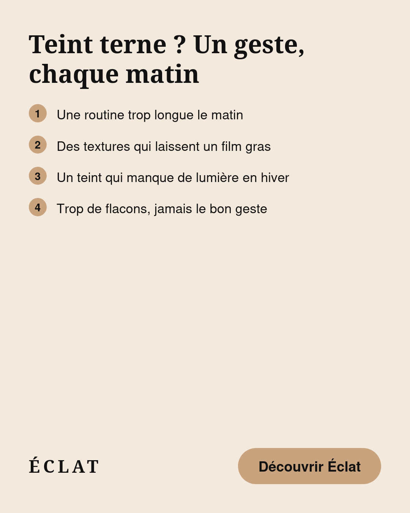
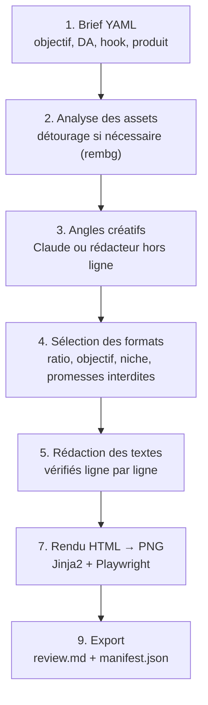

# Ad Agent

Un agent IA qui transforme un **brief** (objectif, direction artistique, hook, produit, images) en plusieurs
**variantes d'ads statiques**, en s'appuyant sur une base de formats construite à partir de vraies publicités
observées sur Meta Ad Library. Chaque variante est un vrai fichier PNG, prêt à publier ou à retoucher.



## Pourquoi ce projet

C'est un projet de portfolio, construit pour montrer un pipeline complet et testé de bout en bout, pas
seulement un prototype :
- Une **base de connaissance réelle** : 8 formats d'ads, chacun documenté à partir de publicités qui tournent
  depuis plusieurs semaines sur Meta Ad Library (protocole reproductible dans [docs/curation.md](docs/curation.md)),
  jamais en copiant leurs visuels.
- Un **rédacteur IA sous contrôle** : chaque texte que Claude propose est revérifié par du code (longueur,
  promesses interdites, chiffres inventés) avant d'être utilisé ; les prix, les avis et les faits ne passent
  jamais par le modèle.
- Un **traitement d'image raisonné, pas juste branché** : le détourage automatique n'est déclenché que si
  l'image ne l'est pas déjà, et le modèle utilisé a été délibérément choisi (voir plus bas) après avoir
  évité de justesse un modèle par défaut sous licence non commerciale.
- **Tout est testé** : 50 tests, plus des vérifications en conditions réelles (vrais appels à Claude, vrai
  détourage, vrais rendus PNG) à chaque étape ajoutée.

## Comment ça marche



Le détail de chaque étape, avec le format exact de ses fichiers de sortie, est dans
[docs/pipeline.md](docs/pipeline.md).

## Démarrage

```bash
python3 -m venv .venv && source .venv/bin/activate
pip install -e ".[dev]"
ad-agent validate                                      # valide briefs et formats
pytest                                                  # 50 tests
ad-agent run briefs/example_soin_peau.yaml --no-png     # génère un run dans outputs/ (HTML)
```

**Rédacteur Claude** (optionnel, sinon le rédacteur hors ligne déterministe est utilisé) :
```bash
pip install -e ".[llm]"
cp .env.example .env   # puis y coller sa clé API Anthropic — jamais dans le code ni en dur
ad-agent run briefs/example_soin_peau.yaml --writer claude
```

**Captures PNG** (sinon seul le HTML est généré) :
```bash
pip install -e ".[render]"
playwright install firefox   # ou chromium / webkit
ad-agent run briefs/example_soin_peau.yaml --browser firefox
```

**Détourage automatique** (optionnel ; sans lui, les images fournies sont utilisées telles quelles) :
```bash
pip install -e ".[assets]"
```
Le modèle est figé explicitement sur `u2net` (Apache 2.0, réutilisable commercialement, ~176 Mo) : le défaut
de la bibliothèque `rembg` a changé vers un modèle de ~1 Go sous licence non commerciale, détecté et évité
pendant le développement (voir [docs/pipeline.md](docs/pipeline.md#le-détourage-automatique-agentassetspy)).

## Structure

```
formats/     base de formats : une fiche YAML par format (structure, zones, hooks, objectifs, source réelle)
briefs/      template de brief + exemples (niches beauté et tech)
agent/       schémas, chargement, rédacteurs (hors ligne / Claude), rendu, CLI
assets/      images produit (non versionnées)
outputs/     runs générés (non versionnés)
docs/        pipeline détaillé, protocole de curation
tests/       50 tests
```

## Règles de la base de formats
- On documente la **structure** d'un format (zones, hiérarchie, hooks adaptés), jamais le visuel d'un concurrent.
- Une pub source est référencée par son ID Meta Ad Library, avec sa durée de diffusion observée
  (une pub active depuis plus de 30 jours est probablement rentable).
- `status: draft` tant qu'un format n'a pas été relu et testé en conditions réelles ; `validated` ensuite.

## Niches
La niche est un **paramètre du brief** (`niche:`), pas une limite de l'agent. Niches gérées : `tech`, `beaute`, `mode`,
`sante_bien_etre`, `animaux` (et `autre`). Les formats sont génériques par défaut ; `niches_fit` restreint un format
aux niches où il excelle (liste vide = universel).

## État actuel

- [x] Base de 8 formats curés sur Meta Ad Library (marché US), protocole documenté
- [x] Pipeline complet brief → variantes → PNG, les 8 formats ont un rendu
- [x] Rédacteur hors ligne (déterministe, gratuit) et rédacteur Claude (sorties structurées, contrôlé)
- [x] Détourage automatique local (rembg/u2net), déclenché seulement si nécessaire
- [x] Zones à plusieurs lignes (infographies), assets étiquetés (avant/après)
- [x] 50 tests (43 + 7 issus de la revue ci-dessous), plusieurs vérifications en conditions réelles
- [x] Passe de revue sur `agent/` (8 constats corrigés : texte illisible sur fond accent, chemins
  d'assets non confinés à la racine du projet, incohérences produit/scène, etc.)

## Prochaines étapes (pas commencées, choix assumés)

- **Finition dans Canva** : Canva n'expose pas son détourage/sa génération d'image via son API pour
  développeurs (vérifié directement sur sa documentation), seulement dans son éditeur. L'usage prévu est
  donc une étape manuelle de finition après notre pipeline : pousser une variante dans un gabarit Canva
  (Autofill API, nécessite un compte Pro) pour l'ajuster visuellement avant publication.
- **Génération de scènes (Nano Banana / Gemini)** : mettrait le produit détouré en situation plutôt que sur
  un simple fond de couleur. Volontairement pas construit pour l'instant : ce serait un second fournisseur
  d'IA (nouvelle clé, nouveau SDK, nouveaux coûts) pour un besoin déjà partiellement couvert par la finition
  manuelle dans Canva ci-dessus.
- **Formats restants à documenter** : comparatif concurrentiel, bénéfices en légendes, faux pop-up d'avis,
  formats bien-être (recherche par marque infructueuse sur Meta Ad Library pour ce créneau).
- **`avant_apres_beaute` avec un vrai contenu** : le mécanisme est fonctionnel et testé, mais seulement avec
  une image réutilisée deux fois (aucune vraie photo avant/après libre de droits trouvée pendant le
  développement). À valider avec de vraies photos consenties.
- **Retour terrain** : mise à jour du score des formats selon les performances réelles observées.

## Licence

[MIT](LICENSE)
